# 翻墙教程
## 安装谷歌浏览器
推荐使用谷歌浏览器，无广告，无捆绑，最重要的是插件资源丰富，可以使用浏览器帮你完成大部分工作。
## 配置浏览器
1. 解压XX-NET到合适位置。
2. 打开谷歌浏览器。
3. 导入证书。在浏览器中设置(Figure 1)->打开“显示高级设置”（在设置选项页的最下面，小字，Figure 2）->管理证书（往下拉,见Figure 3）->导入->点击“下一步”(Figure 4)->浏览->选择证书（Figure 5）。（证书目录在/解压XX_NET的位置/data/gae_proxy/CA）
>- Figure 1:打开设置
>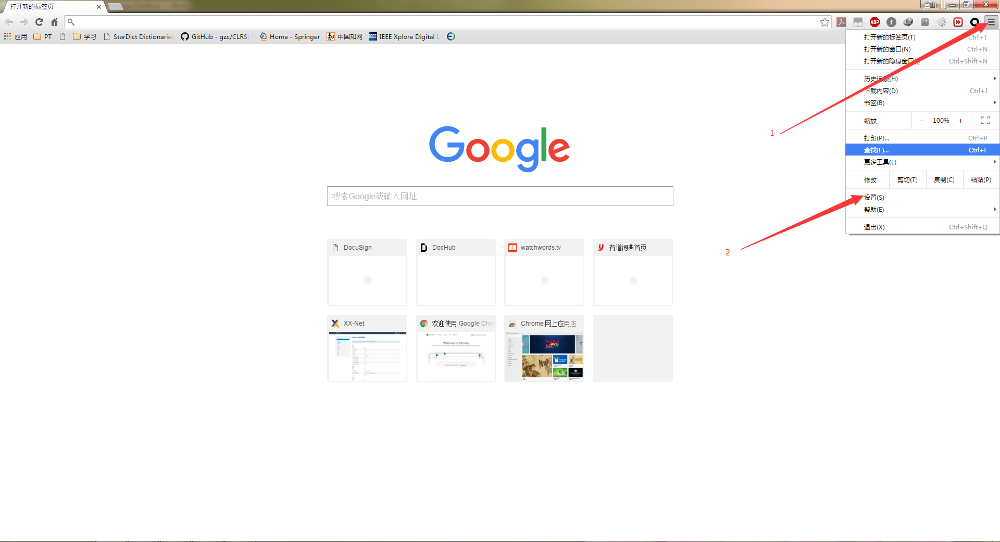
>- Figure 2：打开高级设置
> 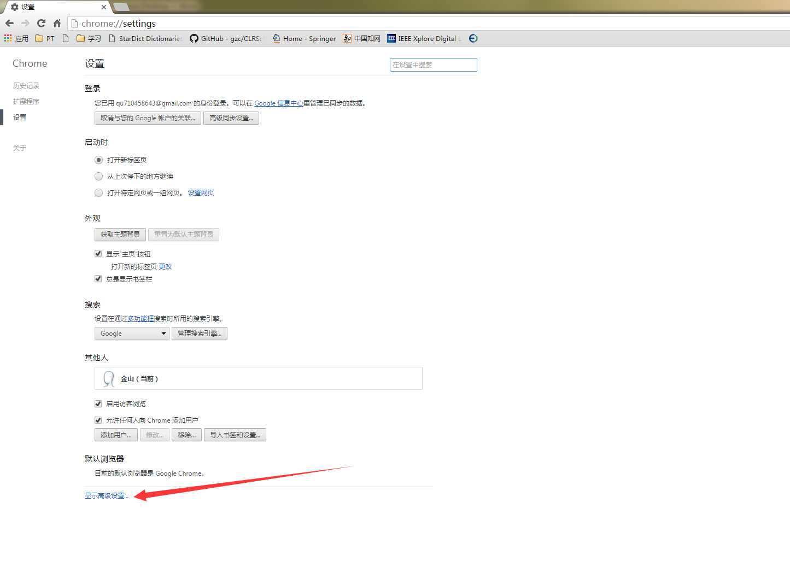
>- Figure 3：打开证书管理
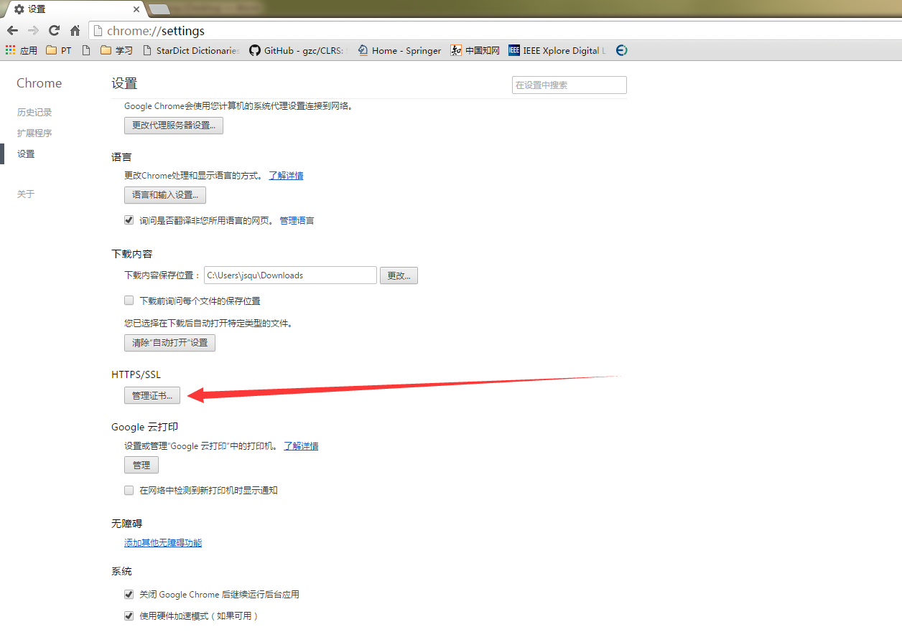
>- Figure 4:导入证书
> 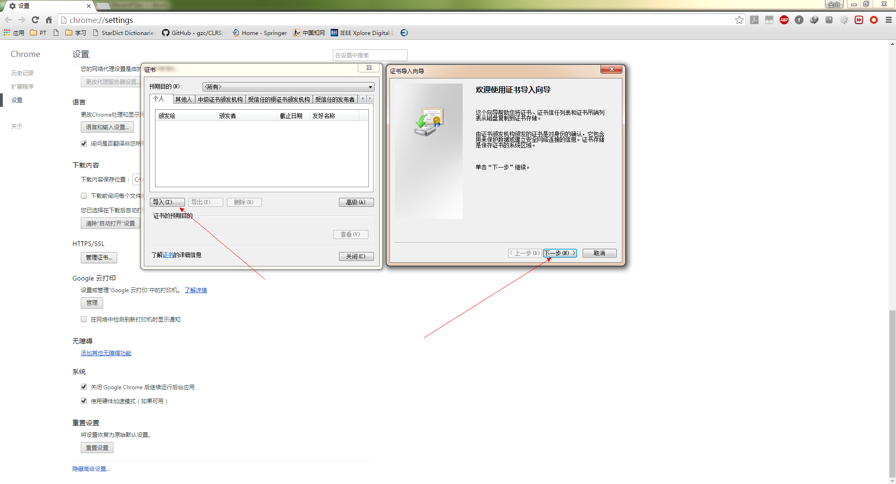
>- Figure 5:选择证书
> 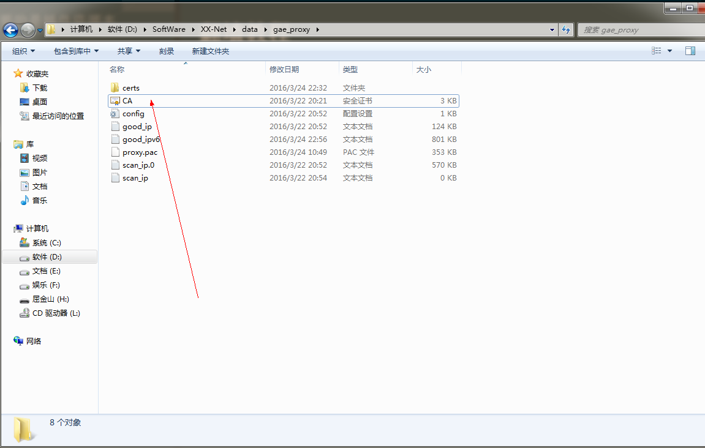

4. 配置代理规则
谷歌浏览器使用SwitchOmega.crx管理代理规则，将`/解压XX_NET的位置/SwitchOmega/SwitchOmega.crx`文件拖入谷歌浏览器的扩展程序中。
>- 首先打开谷歌浏览器的`设置`页面
> Figure 6

>- 切换到`扩展程序`页面
> > Figure 7
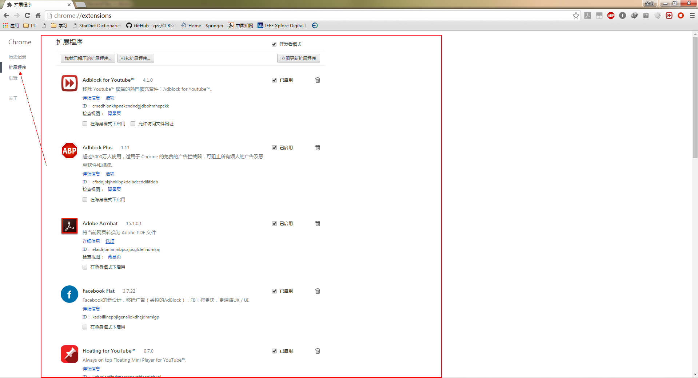
>- 将`/解压XX_NET的位置/SwitchOmega/SwitchOmega.crx`文件拖入谷歌浏览器的扩展程序页面。安装完成以后浏览器工具栏最右边会多出来一个圆形的标志。
> Figure 8
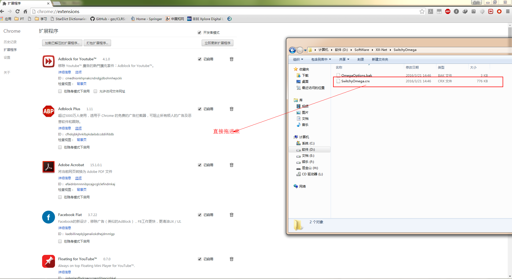

>- 在上面的圆形标志上右键，点击选项，切换到`导入/导出`页面，开始配置规则。
> Figure 9
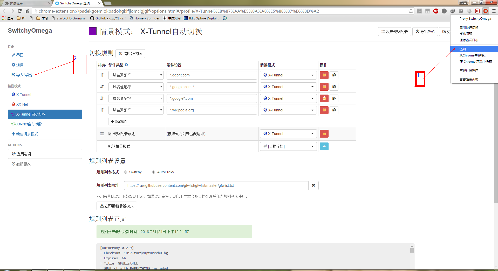
>- 选项当中，点从备份文件恢复（Figure 10）
> Figure 10
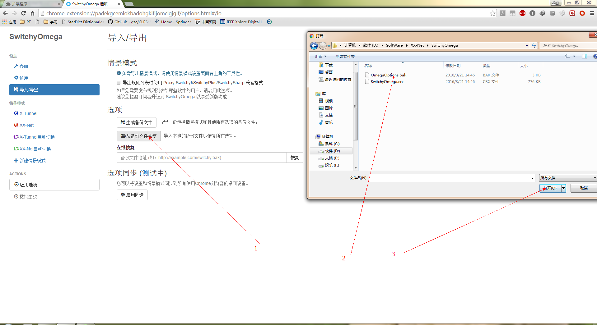

至此，配置已完成。

## 开始翻墙
将谷歌浏览器设置为默认浏览器，打开将`/解压XX_NET的位置/`,双击红框（Figure 11）中的任意一个文件即可打开XX_NET（需要调用Pyhton），然后会自动打开浏览器，选择代理规则(Figure 12)
>Figure 11:
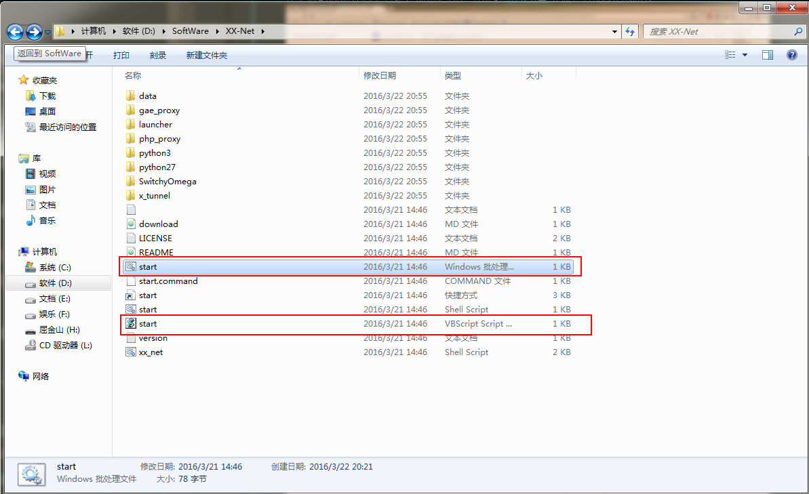
> Figure 12:
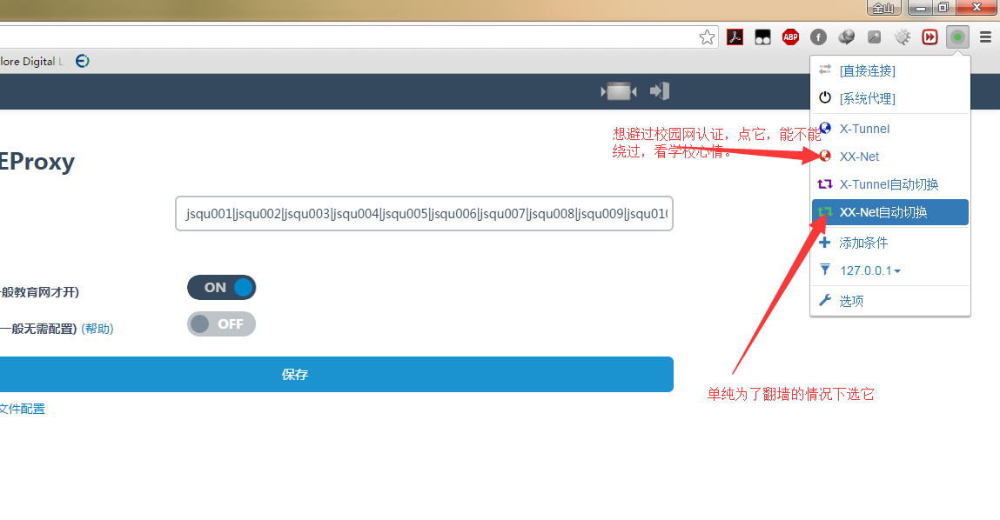
> Figure 13:
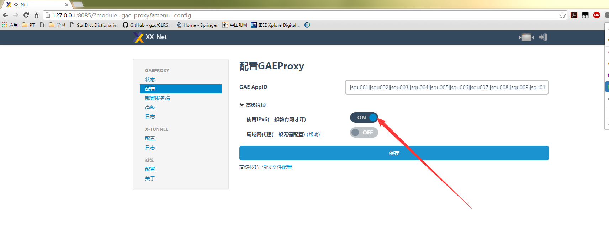
